# 🚀 Demo Spring Boot + Keycloak

## 📝 Overview

This project is a sample Spring Boot application integrating Keycloak for authentication, user registration, sending email, and CRUD operations. It is intended for anyone looking to secure a REST API with Keycloak.

## ✨ Features

- 🔐 Authentication via Keycloak
- 📝 User registration
- 🛡️ Role management (admin, user)
- 🗂️ CRUD operations on main entities

## ⚙️ Prerequisites

- ☕ Java 17+
- 🐘 Maven
- 🐳 Docker (for Keycloak)

## 🚦 Installation & Startup

1. **Clone the project**

   ```bash
   git clone https://github.com/bayembacke221/demo-springboot-keycloak-auth-crud.git
   cd demo-springboot-keycloak-auth-crud
   ```

2. **Start Keycloak with Docker Compose**

   ```bash
   docker-compose up -d
   ```

3. **Configure Keycloak**

   Follow the steps below (see "Keycloak Configuration" section).

4. **Start the Spring Boot application**

   ```bash
   ./mvnw spring-boot:run
   ```

## 🛠️ Keycloak Configuration

1. **Create a Realm**  
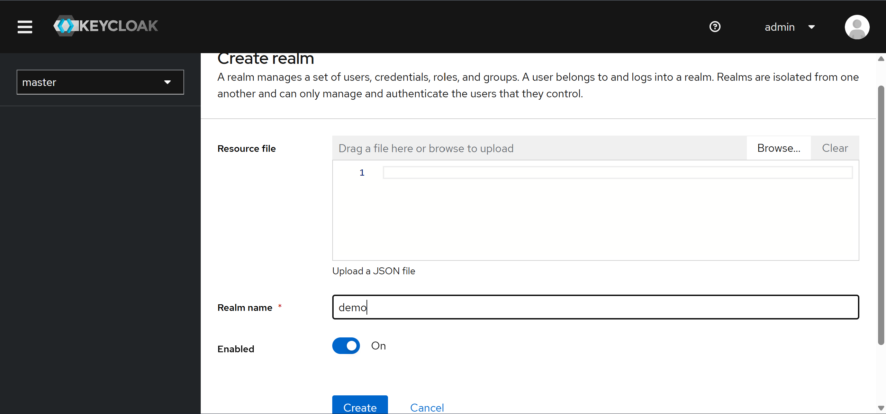

2. **Create a Client**  

<br>

<br>


3. **Create roles**  
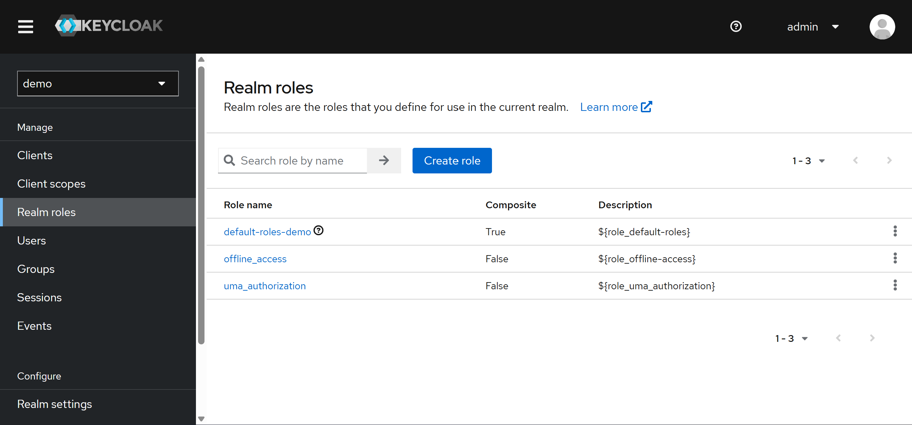
<br>
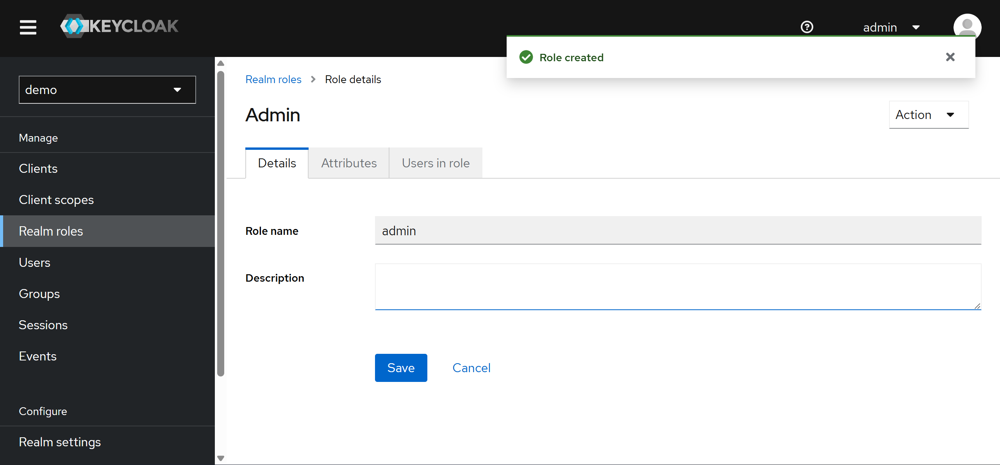
<br>
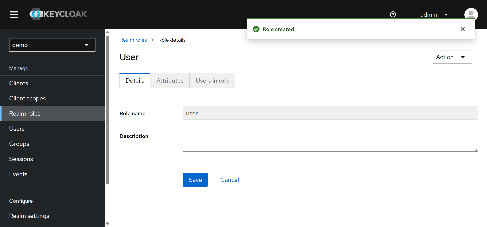

4. **Create a user**  
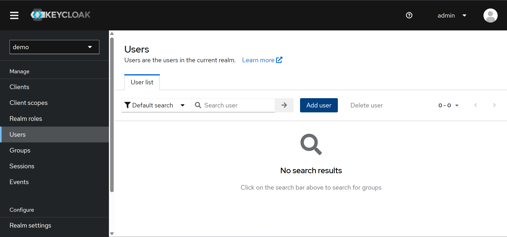
<br>
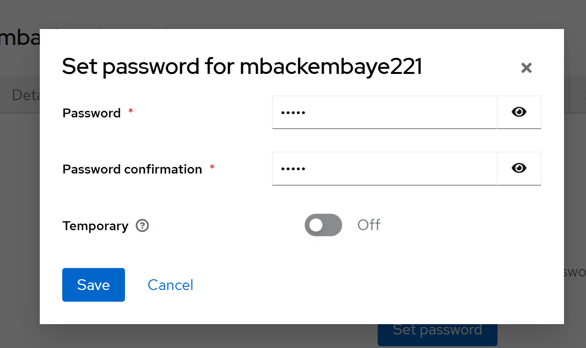
<br>
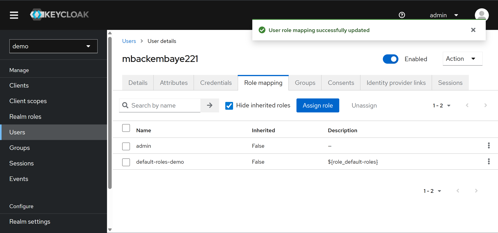

## 📡 API Usage

- 🔑 **Authentication**: Get a token via `/auth/realms/demo/protocol/openid-connect/token`
- 📝 **Registration**: User registration endpoint (e.g. `/api/register`)
- 🗂️ **CRUD**: Endpoints to create, read, update, and delete entities protected by Keycloak

> See the source code for endpoint details (`src/main/java/sn/malcolm/demo/controller/`)

## 🗃️ Project Structure

```text
src/
  main/
    java/sn/malcolm/demo/
      controller/      # REST Controllers
      model/           # JPA Entities
      repository/      # Spring Data Repositories
      security/        # Keycloak Configurations
      service/         # Business Logic
      view/            # DTOs
  resources/
    application.properties
keycloak/              # Keycloak configuration screenshots
```

## 🖼️ Application Screenshots

Here are some examples of API usage with Postman:

### 🔑 Authentication (Login)
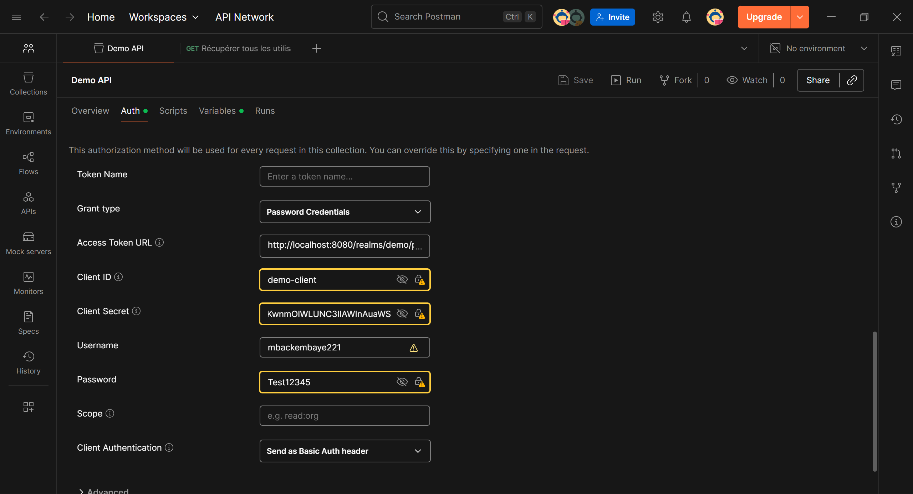

### 📝 Create a user
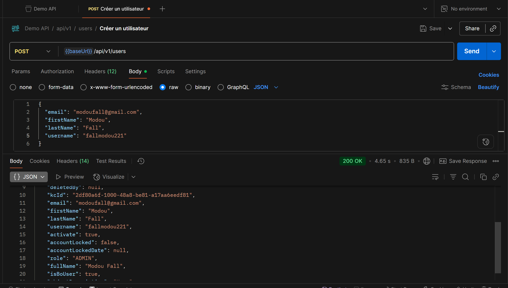

### 📧 Send email creation
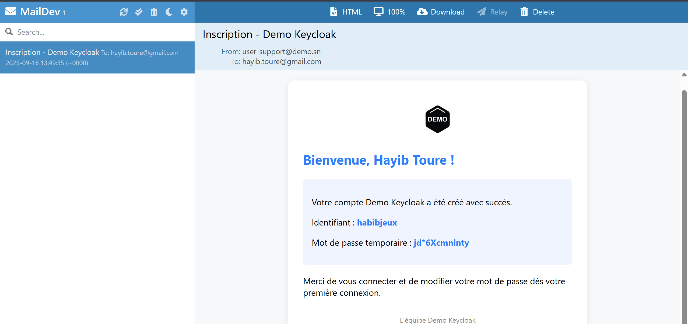

### 📋 Get all users
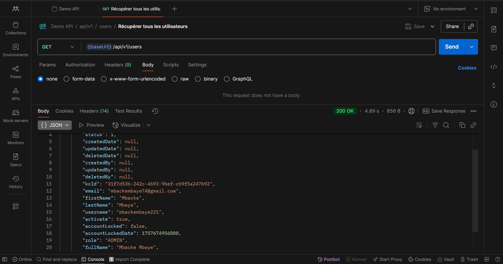

### 🔍 Get user by ID
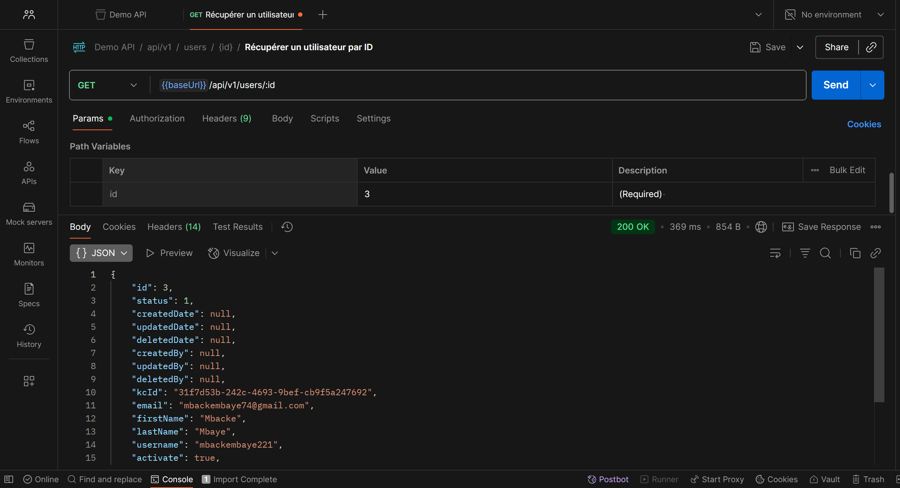

### ✏️ Update a user
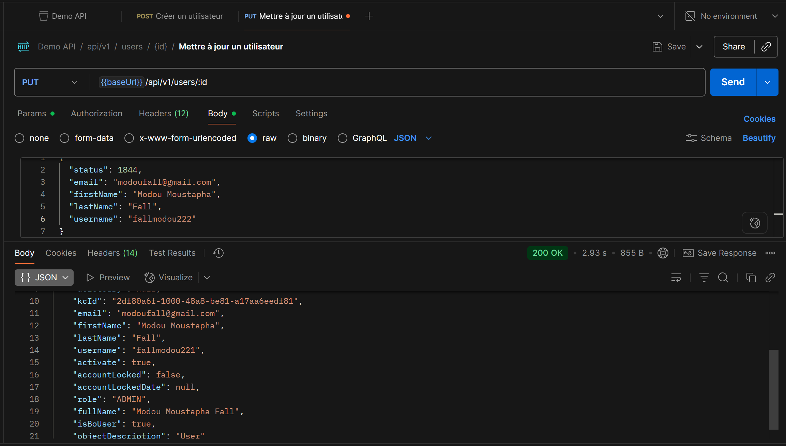

### ❌ Delete a user
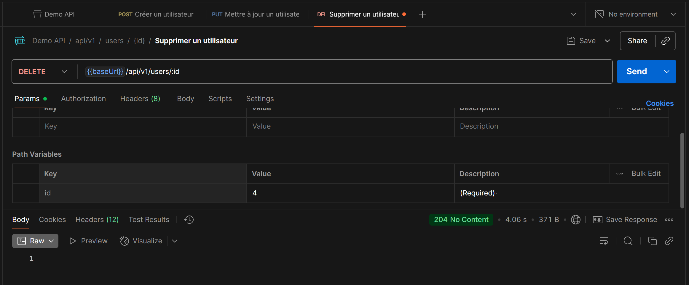

### 🔄 Reset password (reset-password)

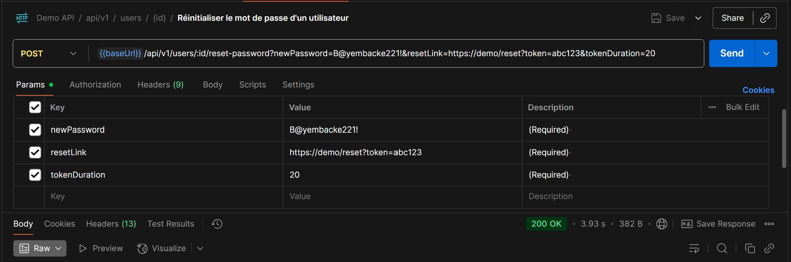
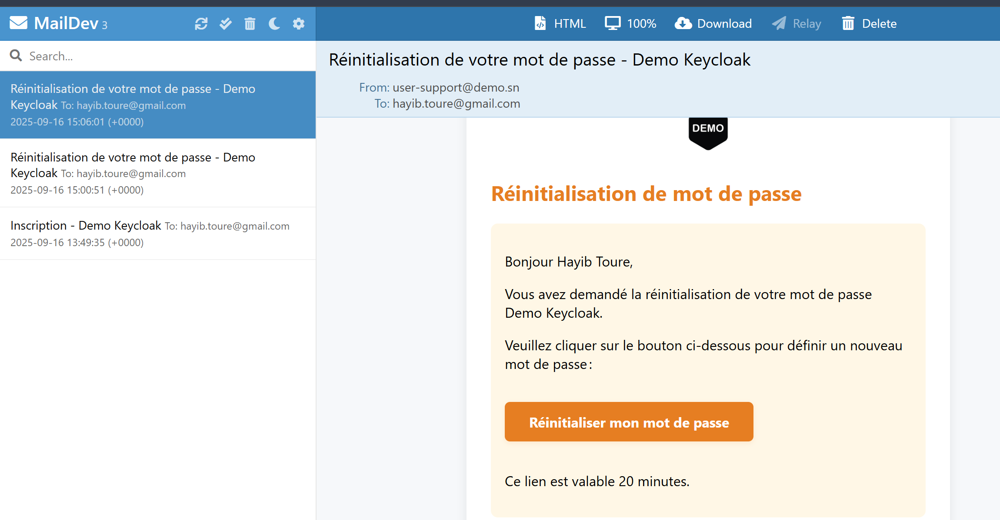

### 🔒 Change password (change-password)

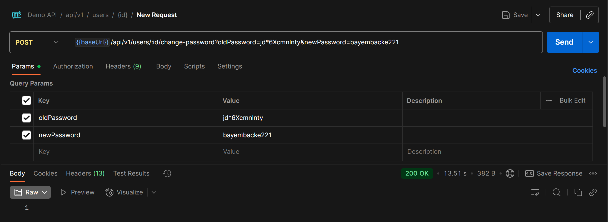

## 📚 Useful Resources

- [📖 Keycloak Documentation](https://www.keycloak.org/documentation)
- [🔗 Spring Security & Keycloak](https://www.baeldung.com/spring-boot-keycloak)

## 👤 Author

- Mbacke Mbaye

---
Feel free to contribute or open an issue! 😃
